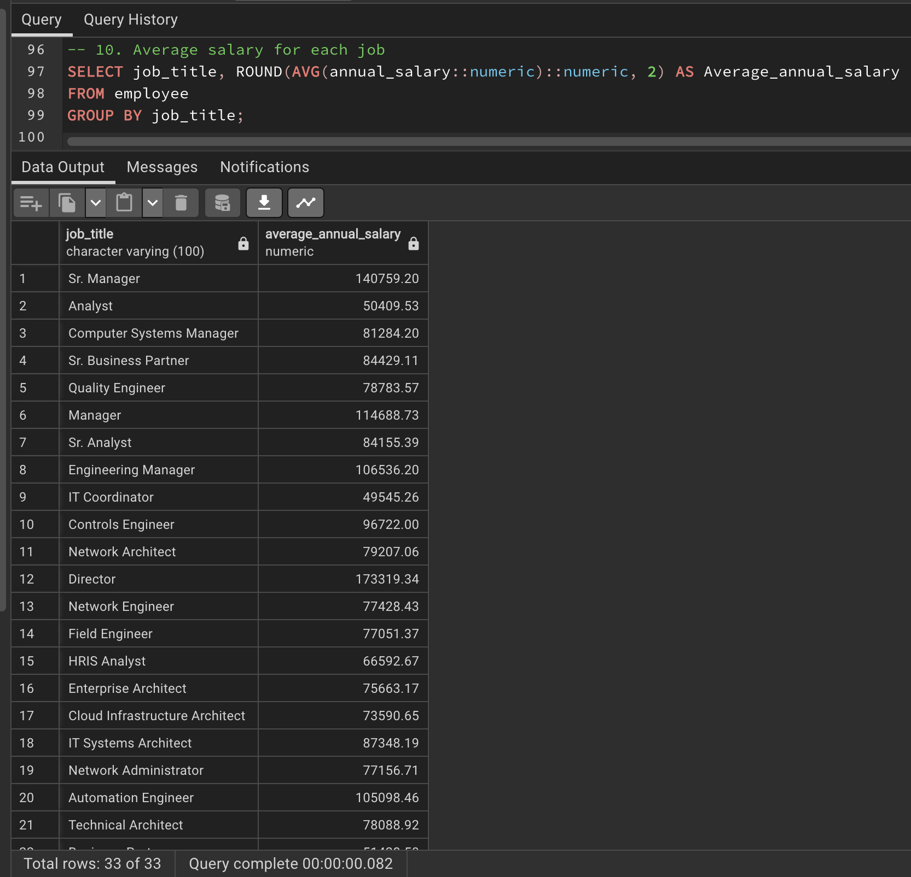

# Employee-Analytics-and-Insights-Exploring-HR-Metrics-and-Trends
This repository delves into a thorough analysis of Splendor Investments workforce data, offering valuable insights into various aspects of employee dynamics by leveraging the power of SQL. From understanding the distribution of employees across different departments, genders and ethnicities to exploring compensation trends, tenure patterns and the impact of age on bonus percentages.

## Introduction
In today's rapidly evolving business landscape, organizations are recognizing the pivotal role of data-driven insights in making informed decisions, particularly in the realm of human resources. This project aims to harness the power of data analysis by leveraging the power of SQL to provide valuable insights into employee performance, compensation, demographics, and trends. By leveraging this information, companies can optimize their workforce strategies, enhance decision-making, and drive overall business success. We see the power of SQL to transform raw data into meaningful insights, guiding the organization towards enhanced HR strategies, improving employee experiences and greater success.

## Problem Statement
The traditional approach to workforce management often lacks the precision and agility needed to address the dynamic challenges of today's business environment. Companies frequently face difficulties in optimizing employee compensation, understanding demographic distributions, and making informed decisions about promotions, bonuses, and departmental allocations. This project addresses these challenges by conducting comprehensive data analysis and deriving actionable insights from employee data.  
I was tasked with finding answers to the following problems.  

1. How many employees are there in each department?
2. What is the average age of employees in the Sales department?
3. Who are the top 5 highest-paid employees in the company?
4. What is the distribution of employees across different genders and ethnicities?
5. How has the average salary changed over the years?
6. Which department has the highest average bonus percentage?
7. Identify employees who exited the company within their first year.
8. Calculate the total annual salary expenditure for each business unit.
9. What is the average age of employees in each city?
10. Determine the average salary for each job title.
11. Compare the average bonus percentage between different departments
12. How many employees have left the company, and what is their average tenure?
13. Identify employees who have been with the company for more than 10 years.
14. Calculate the average bonus percentage for employees under the age of 30.
15. Compare the distribution of bonus percentages across different ethnicities.

## Project Objective
Analyzing employee data at Splendor Investments where I will work with a comprehensive dataset containing detailed information about employees within the company. The task is to leverage SQL to explore and analyze the dataset, extracting valuable insights to aid in understanding the company's workforce better.  
This project takes it a step further by visualizing key performance indicators (KPIs) through a dynamic Power BI dashboard.  
**Dataset:**
I was provided with a dataset containing the following key attributes:  
- Employee ID
- Full Name
- Job Title
- Department
- Business Unit
- Gender
- Ethnicity
- Age
- Hire Date
- Annual Salary
- Bonus Percentage
- Country
- City
- Exit Date

## Data Analysis
I conducted an in-depth analysis of the provided employee dataset, which included information on employee demographics, job titles, compensation, performance metrics, and more. The analysis covered a range of key questions, including the average age of employees in different departments, identifying top earners, distribution of employees across gender and ethnicity, trends in average salary over time, average bonus percentages by department, tenure of departed employees, and more.  
The first step was to create the table in the database.

Then, you check to see if the columns have been loaded into the table.

For problem 1, How many employees are there in each department?
This provides an insight into the distribution of employees at Splendor Investments across the different departments. This will help you identify departments with the highest and lowest number of employees.  
The IT department has the most employees in the company at 277 and the Finance department has 98 employees which is the least number of employees.

2. What is the average age of employees in the Sales department?
This query calculates the average age of employees in the Sales department. It provides an insight into the average age distribution of employees working in the Sales department.  
The average age of employees in the sales department is 43 years.

3. Who are the top 5 highest-paid employees in the company?
This query lists the top 5 highest-paid employees along with their job titles and annual salaries. It helps identify the employees with the highest compensation.  
The 5 Highest-paid employees are Robert Rogers, Kinsley Huynh, Christopher Luu, Eloise Williams and Ariana Sharma who are holding the position of Vice-President for their respective departments.
 

4. What is the distribution of employees across different genders and ethnicities?
This query groups employees by their gender and ethnicity, and counts the number of employees in each category. It provides a breakdown of the diversity within the organization.  
The Asians are the most employed ethnicity. The Asian males are 210 and Asian females are 222.

5. How has the average salary changed over the years?
This query calculates the average salary for each year based on the hire date. It helps visualize how the average salary has changed over the years.

 
6. Which department has the highest average bonus percentage?
This query identifies the department with the highest average bonus percentage. It offers insights into departments that have a higher bonus distribution.  
The Accounting department has the highest average bonus percentage at 11.60%.

7. Identify employees who exited the company within their first year.
This query identifies employees who left the company within one year of their hire date. It helps monitor and analyze early employee attrition.  
We have 25 employees who left the company within their first year.

8. Calculate the total annual salary expenditure for each business unit.
This query calculates the total annual salary expenditure for each business unit. It provides insights into the salary costs associated with different business units.  
The Specialty Product business unit had the highest salary at $29,233,402 while the Manufacturing business unit had the least salary at $24,112,825.

9. What is the average age of employees in each city?
This query calculates the average age of employees in each city. It helps understand the age distribution of employees across different locations.  
The average ages of employees in the city lies between 43 years and 46 years.

10. Determine the average salary for each job title.
This query calculates the average salary for each job title. It helps compare the compensation levels across different job roles.  

11. Compare the average bonus percentage between different departments.
This query calculates the average bonus percentage for each department. It offers insights into the bonus distribution across different departments.  
The Accounting department has the highest average bonus percentage at 11.60% while the IT department has the lowest average bonus percentage at 4.25%

12. How many employees have left the company, and what is their average tenure?
This query counts the number of employees who left the company and calculates their average tenure. It provides insights into employee turnover and tenure.  
103 employees have left the company. 

13. Identify employees who have been with the company for more than 10 years.
This query identifies employees who have been with the company for more than 10 years. It helps identify long-term employees.  
466 employees have been with the company for more than 10 years.

14. Calculate the average bonus percentage for employees under the age of 30.
This query calculates the average bonus percentage for employees under the age of 30. It offers insights into the bonus distribution for younger employees.  
We have 5 employees below the age of 30. The highest average bonus percentage is 11.74% for an employee aged 28 years and the lowest average bonus percentage is 5.79% for an employee aged 27 years.

15. Compare the distribution of bonus percentages across different ethnicities.
This query calculates the median bonus percentage for each ethnicity group. It provides insights into how bonus percentages vary across different ethnicities.  
The employees who identify as Asians had the highest average bonus percentages at 8.28% and accounted for 432 people at the company.  
The employees who identify as Caucasians had the lowest average bonus percentages at 7.31% and accounted for 222 people at the company.

Here are some KPIs that could help us understand and solve some business problems.
1. Average Age in Departments: This shows the average age of employees in the various departments.
2. Diversity Metrics: Measures the distribution of employees across different genders and ethnicities.
3. Churn Rate and Average Tenure: Identifies the number of employees who left the company and calculate their average tenure.
4. Bonus Percentage Distribution by Ethnicity: Compares the distribution of bonus percentages across different ethnicities.
5. Early Attrition Rate: This shows the percentage of employees who exited the company within their first year of employment.
6. Department and Bonus Percentage: Determines which department has the highest average bonus percentage.
7. Departmental Headcount: Measures the total number of employees in each department.
8. Salary Trends Over Time: This shows how the average salary has changed year by year to identify trends.
9. Total Salary Expenditure by Business Unit: This shows the total how much money in terms of salary the company spends for each business unit.
10. Long-Term Employee Retention: Indicates the number of employees who have been with the company for more than 10 years.

## Visualization
To better understand our solutions and give better credence to our findings, we made some visualizations using Microsoft Power BI. Also, attached to this project, is the Power BI file as well as SQL codes.

## Recommendation
Based on our data-driven insights, I make the following recommendations to Splendor investment company aiming to enhance its workforce management and decision-making:

Optimize Compensation Strategies: Utilize insights on employee salaries, bonus percentages, and compensation trends to ensure fair and competitive compensation packages, which will lead to improved employee satisfaction and retention. Link salary adjustments with job performance, responsibilities, and market benchmarks. Recognize and reward high-performing employees with competitive compensation.

Promotion and Department Allocation: Leverage employee performance data to make informed decisions about promotions and departmental reallocations, ensuring that the right talent is put in the right role.

Diversity and Inclusion: Address disparities in gender and ethnicity distributions by implementing targeted diversity and inclusion initiatives to foster a more representative workforce.

Talent Retention: Identify employees with short tenures or those leaving within their first year, and design onboarding and engagement strategies to improve retention rates. Provide mentorship, professional development, and growth opportunities to young employees to increase their engagement and commitment.

Business Unit Efficiency: Understand the distribution of salary expenditures across business units to allocate resources effectively and optimize workforce planning.

Strategic Workforce Planning: Leverage insights on average age and tenure to develop succession plans and ensure a well-prepared future workforce. Establish mentorship programs to transfer knowledge from long-term employees to newer hires. Conduct regular engagement surveys to identify areas for improvement.

## Conclusion
Organizations can significantly improve their workforce management strategies and overall success by integrating data-driven HR analytics. Employers can use insights obtained from this project to make well-informed decisions about employee compensation, promotions, and diversity initiatives. An organization with a data-driven approach is better prepared to deal with workforce challenges, improve employee engagement, and foster a culture of continuous improvement. For a business to remain competitive and grow sustainably, data-driven HR analytics are not only a strategic decision but a necessity.

